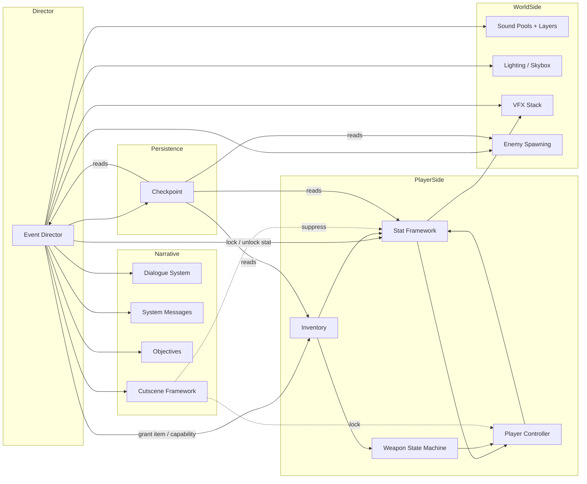
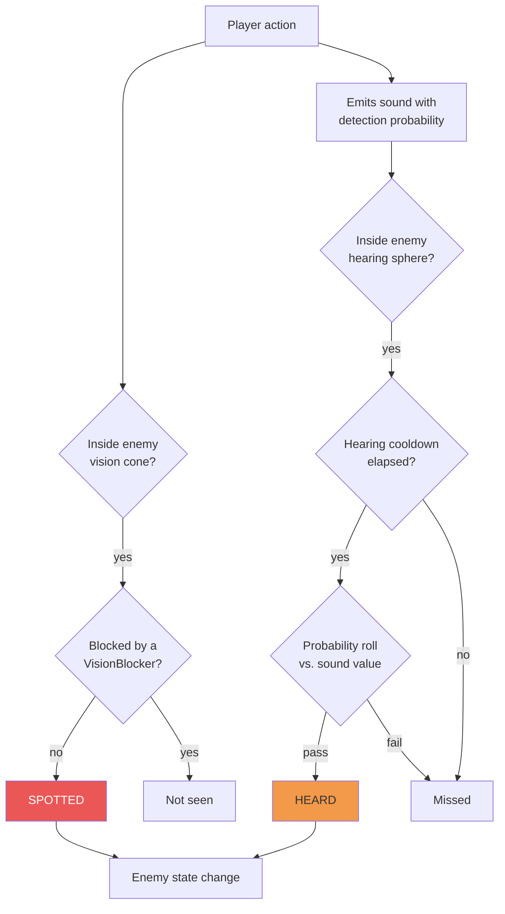
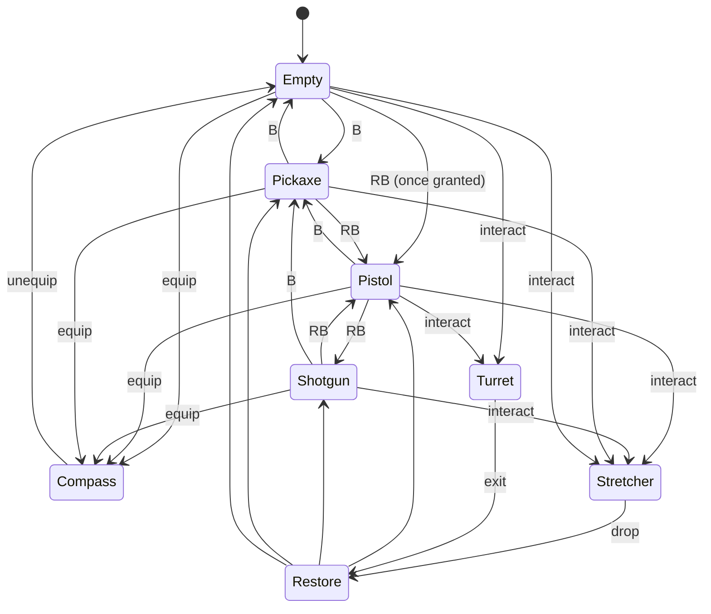
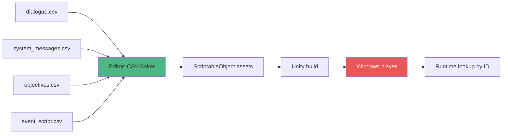

# System Architecture — Mr. Moonlight

How the systems relate, what depends on what, and where the real bottlenecks are.

> ## ⚠️ Partially superseded 2026-08-27
>
> **WebGL was dropped on 2026-08-25** in favour of a **Windows 64-bit standalone** build at
> 1920×1080 — see `Docs/pc-build-target.md`. Three things in this document are now stale, and are
> corrected inline below rather than deleted, because the dependency structure they describe is
> still right:
>
> 1. The §1 graph node **"MRM-10 First WebGL build"** — MRM-10 as written is void (its scope, its
>    acceptance criteria and its 960×540 embed decision are all browser-specific). The *dependency*
>    it encodes — a controller must exist before there is anything to put in a build — still holds.
> 2. The §1 node **"MRM-6 WebGL spike"** — the spike ran and its answer ("GO for WebGL") was
>    **reversed** by measurement. Kept as history.
> 3. The §5 **"WebGL bundle"** build step and its rationale — see the correction in that section.
>
> **The §6 risk table has also moved on**; corrections are inline there.

---

## 1. The dependency graph

What blocks what. **Read top to bottom — nothing below can start until what feeds it exists.**

```mermaid
graph TD
    T[MRM-58 Terrain blockout<br/>+ vegetation] --> AStar[MRM-27 A* pathfinding]
    T --> Staging[MRM-59/60/61 Staging]

    Tun[MRM-7 MoonlightTunables] --> Ctrl[MRM-9 FPS controller]
    Input[MRM-8 Input System] --> Ctrl

    Ctrl --> Aim[MRM-21 Aim cone + ADS]
    Ctrl --> Build[MRM-10 First playable build<br/>⚠ issue still says WebGL]
    WebGL[MRM-6 platform spike<br/>⚠ answer reversed 2026-08-25] --> Build

    Aim --> Pistol[MRM-22 Pistol]
    Aim --> Shotgun[MRM-24 Shotgun]
    Dummy[MRM-20 Sparring dummy] --> Pistol
    Dummy --> Shotgun

    AStar --> States[MRM-29 Enemy state machine]
    Cones[MRM-28 Vision cones] --> States
    AStar --> Wolf[MRM-33 Wolf]

    States --> Spotter[MRM-34 Spotter]
    States --> Zealot[MRM-35 Zealot]
    Cones --> Zealot
    Shotgun --> Spotter

    Pool[MRM-38 Sound pools<br/>+ audible distance] --> Foot[MRM-39 Footsteps]
    Foot --> Hear[MRM-30 Enemy audio detection]
    Pool --> Hear
    Foot --> Boots[MRM-40 Boots]

    Stats[MRM-12 Stat framework] --> Death[MRM-17 Death sequence]
    Stats --> Subst[MRM-48 Substance stats]

    Inter[MRM-16 Interaction] --> Items[MRM-41 Item framework]
    Inter --> Drops[MRM-26 Weapon drops]

    ED[MRM-11 Event Director] --> Script[MRM-62 Day 1 event script]
    Dial[MRM-13 Dialogue] --> Script
    Sys[MRM-14 System msgs + objectives] --> Script

    Script --> M1{{M1 — Sept 1<br/>PLAYABLE LOOP}}
    Build --> M1
    Death --> M1
    Menus[MRM-18/19 Menus] --> M1

    style M1 fill:#B84A4A,color:#fff
    style T fill:#F2994A
    style AStar fill:#F2994A
    style ED fill:#F2994A
    style Script fill:#F2994A
```

**The orange nodes are the bottlenecks.** Everything enemy-shaped waits on terrain → A*. Everything narrative waits on the event director. **The terrain blockout is Carlos's own task and it blocks the largest subtree in the project** — that is why it sits in M0.

---

## 2. Runtime interaction — who talks to whom

**Two things to read out of this diagram:**

1. **The Event Director touches almost everything.** That is by design — it is the level's director. But it means **its API is the most important interface in the project**, and a bad verb schema costs a rewrite of every scene. This is why MRM-11 is an Opus issue with a "propose the format and stop for approval" handoff.

2. **The Checkpoint system reads from everything.** Every new stateful system is a potential save-breaking change. When adding one, ask whether it needs to be in the ledger — and if it does, add it to MRM-45's list in the same session, not later.

---

## 3. The detection pipeline

Stealth is the game's core loop. This is how "did the enemy notice me" resolves:

**The inputs to that "detection probability" are the whole stealth design:**

| Player state | Noise |
|---|---|
| Crouched, barefoot, on grass | Almost silent |
| Walking, barefoot | Quiet |
| Walking, boots, on dry leaves | Loud |
| Sprinting, boots | Very loud |
| Firing a shotgun | Loudest thing in the game |

Plus the flashlight, which makes her **visible** rather than audible — a separate axis.

**Design note worth preserving:** every safety mechanism in this game costs something. Boots make you fast but loud. The flashlight lets you see but marks you. The compass shows you north but locks your camera down. The inventory heals you but freezes you in place. **Keep that symmetry when tuning — it is the game's best idea.**

---

## 4. The weapon state machine

Every "what is Tracey holding" state passes through one machine (MRM-25). Do not scatter `if (holdingShotgun)` across systems.

**The traps in this diagram:**

- **Unequipping the compass returns to `Empty`, not to the previous weapon.** That is what the spec says. It is unusual, so it will look like a bug — comment it.
- **Stretcher and Turret must restore the previous state**, which means storing it. Failing to do so is the most likely source of "my gun disappeared" reports.
- **Every transition plays lower-then-raise.** One animation rule, applied universally.
- **Switching mid-reload or mid-swing must resolve cleanly.** Test it deliberately.

---

## 5. Data flow — authoring to runtime

**The rule this diagram encodes: CSV never reaches the build.** It is authoring format only. The baker converts it to ScriptableObjects at edit time, and the build ships those.

This is not a preference. The original reason was that **WebGL has no filesystem**, so runtime CSV
parsing would either fail or stall. *(Corrected 2026-08-27: the Windows player does have a
filesystem, so that specific failure mode is gone.)* **The rule stands on its remaining reasons,
which were always the better ones:** baking is faster at runtime, and it catches malformed rows in
the editor where they can be fixed rather than in a shipped build where they cannot.

**Also note:** this is exactly the integration story Assignment #10 wants described, and *"output lands in the engine and functions without manual reformatting"* is worth 2 points. Building the baker early is worth marks as well as time.

---

## 6. Where the schedule risk actually is

| Risk | Why | Mitigation |
|---|---|---|
| **Terrain blockout slips** | Blocks A*, which blocks every enemy | It is in M0 for this reason. Ugly is fine. Boxes are fine. |
| **Event director schema is wrong** | Every scene is authored against it; changing it means re-authoring | Opus designs it, Carlos approves it **before** implementation |
| ~~**WebGL build discovered late**~~ | ~~Every failure mode is browser-only~~ | **Retired 2026-08-27** — WebGL is not a target. This risk was real and it fired: the browser draw-call ceiling is what forced the platform change on 2026-08-25. |
| **Nothing on `main` has been in a build** | Editor verification has repeatedly given false readings here (`UnityStats` includes Scene View; the editor does not render unfocused) | **Build and launch the .exe.** Latest build is 21, dated 2026-08-25; the main menu and the whole interaction/item/inventory framework have never run in one |
| **`RetroTerrainLit` fails to compile on Direct3D11** | Graphics API is "D3D12, D3D11 (auto)", so a player machine can fall back onto a broken **terrain** shader variant | Third-party bug in Retro Shaders Pro; no material setting fixes it. Untracked — needs an issue |
| **Mocap for the cabin scene** | Longest cutscene, 3 characters, heaviest animation load | Dummy characters are explicitly allowed — do not let modelling block it |
| **Audio blows the 1 GB budget** | 250 VO lines + pools on every prop | Budget per category in MRM-6; compression presets set once. *(2026-08-27: far less acute than when written — build 21 was **54 MB zipped** against 1 GB, and 1 GB is now itch.io's upload limit rather than a runtime budget.)* |
| **Event script deadlocks** | A stranger gets stuck and the Assignment #10 gate fails | Every `wait_for` gets a timeout or a written justification |
